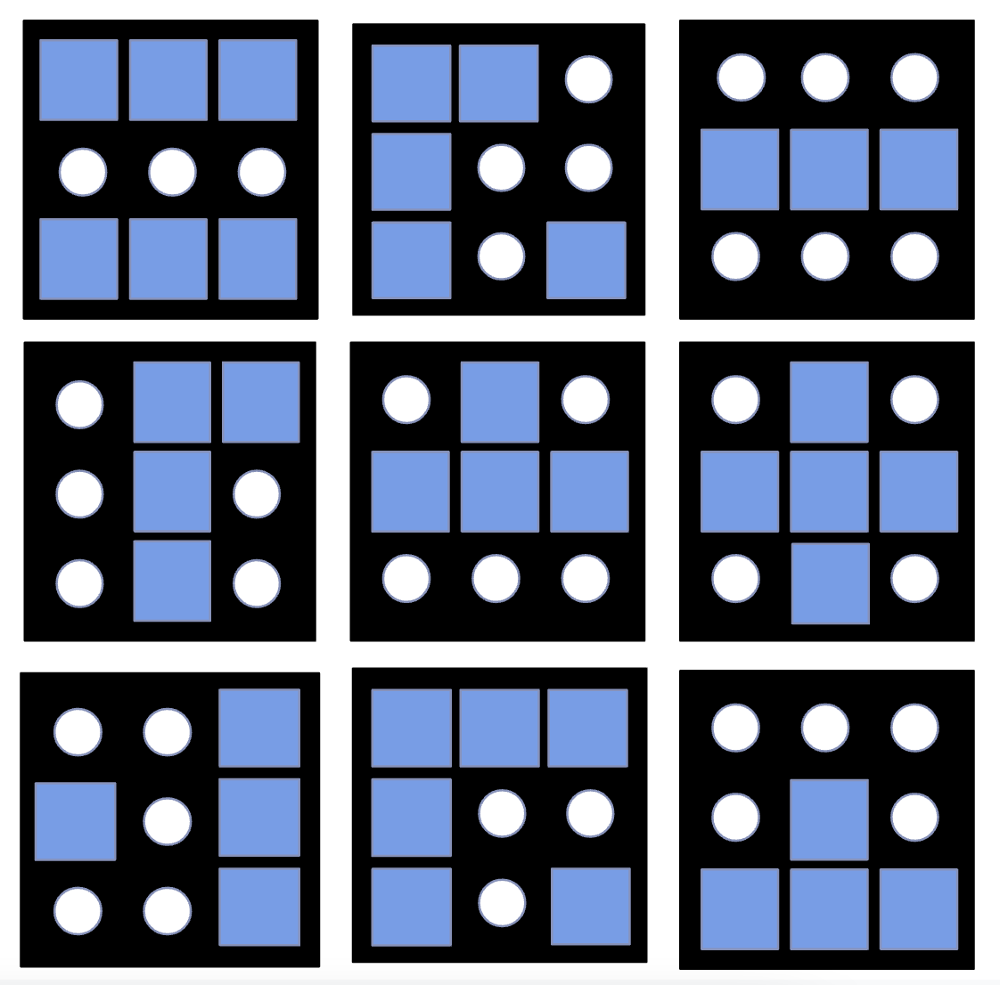
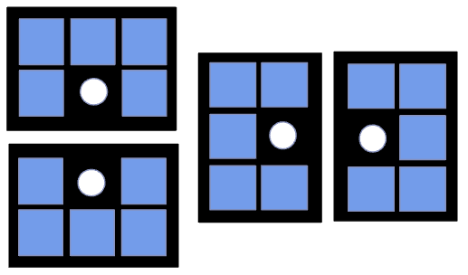
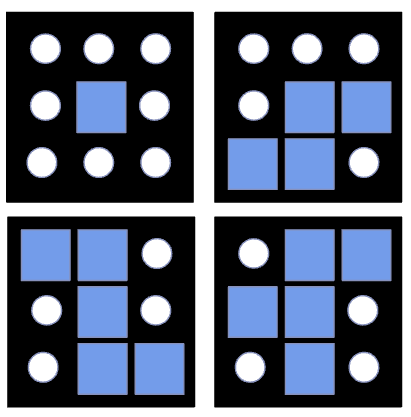
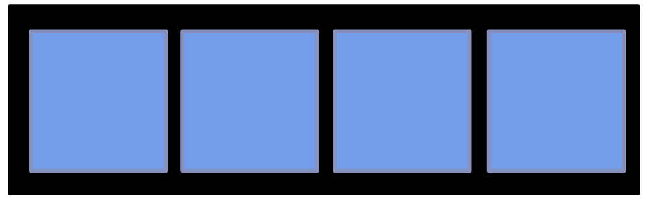
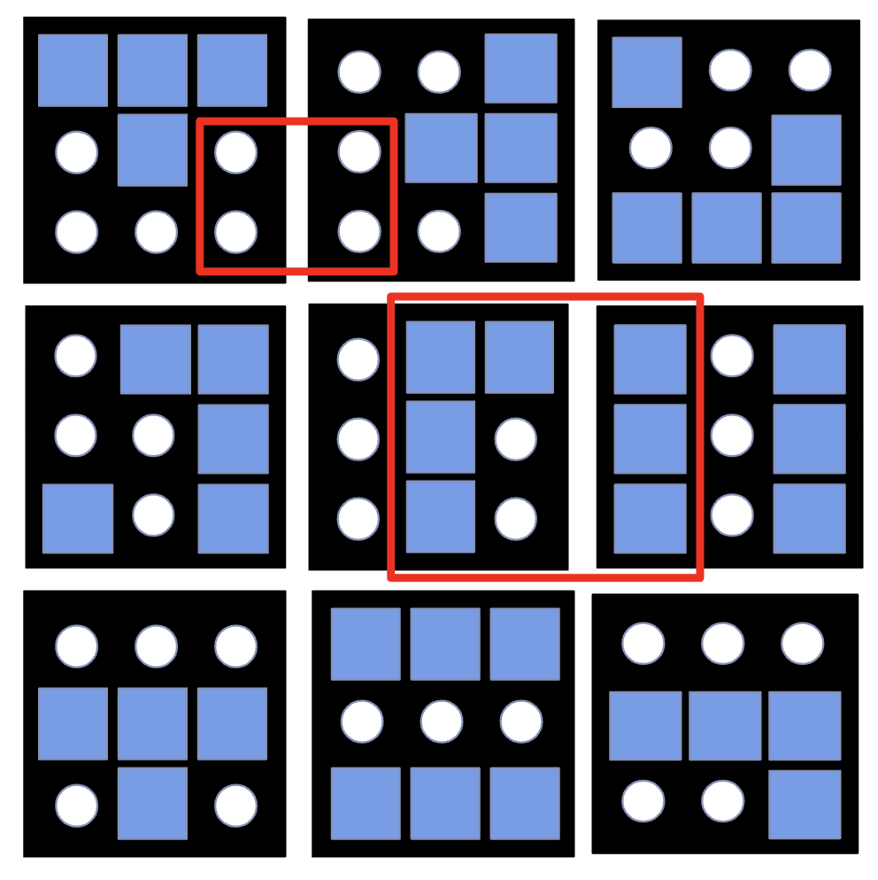
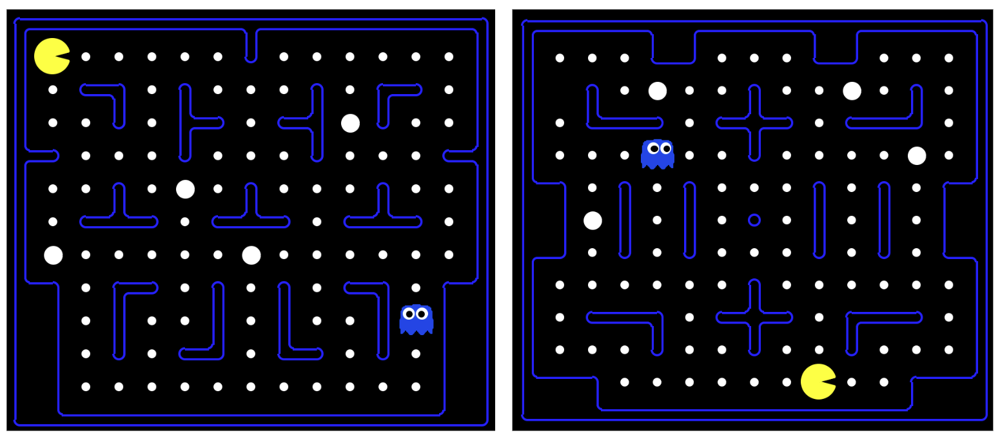

# Pacman Maze Generator
A pacman maze generator, using genetic algorithm and customized fitness metrics. Generally using $+$-selection since it provided better performance.

_____

## Run

```
python genetic_algorithm_multi.py
```
Will run multithreading approach to generate 4 new layouts saved to the examples folder
_____

## Population

Population = ($\mu$, $\lambda$), where $\mu$ number of individuals and $\lambda$ is the number of offspring.

Each individual consists of half of the maze, which can follow a size of $n\times m$, where $n$ and $m$ are multiples of $3$. Each individual is initialized through stochastic selection from the $3\times3$ building blocks:




 The blocks shown in this figure, were then rotated by [$90^{\circ}, 180^{\circ}, 270^{\circ}$] and flipped across the vertical axis in order to create all possible combinations of valid blocks. These were $35$ in total. 

_____

 ## Fitness

 For the evaluation of the individual we have used number of different $2\times2$, $3\times3$, $3\times2$, $2\times3$ and $4\times1$ blocks, which contain patterns that would violate the constraints of a Pac-Man maze. For the $4\times1$ which essentially is just four walls in a row, we only needed to transpose it in order to check both column-wise and row-wise for the existence of said pattern. Invalid blocks shown below.
 <p float="left">
  
   
    
  
</p>

_____

## Mutation

The main idea behind the mutation algorithmic approach is that we evaluate each respective block in the maze for violation of validity on blocks. We then proceed to add proportional fitness to each of the block that are inside the violation (red area in picture below). Finally, blocks with higher fitness will have higher probability of being mutated and switched to different valid block. 

Minimization problem, until fitness is zero.



_____

## Example outputs
The outputs layouts were used in the Berkeley pacman implementation (adapted to Python 3 by [jspacc](https://github.com/jspacco/pac3man)). Screenshots were taken from the game instances using the generated layouts. 


